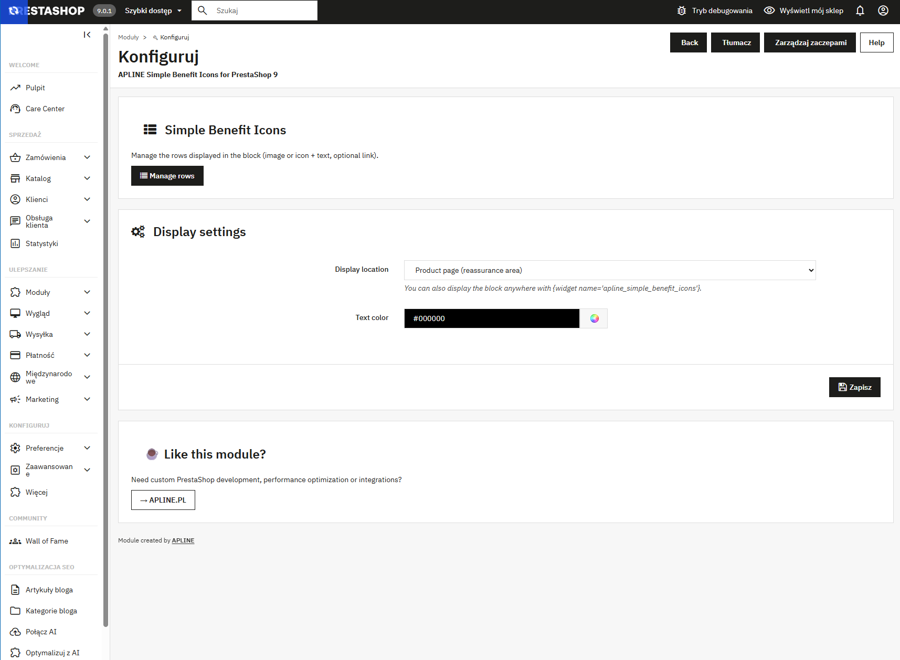
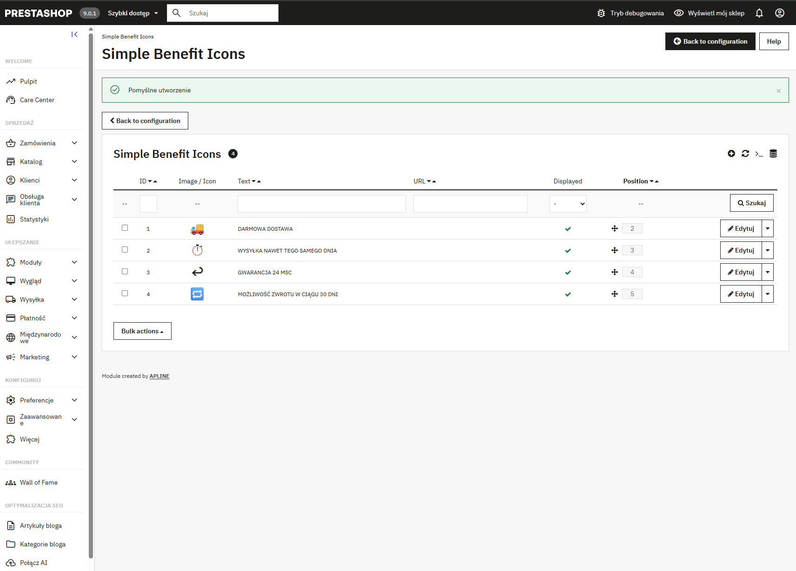
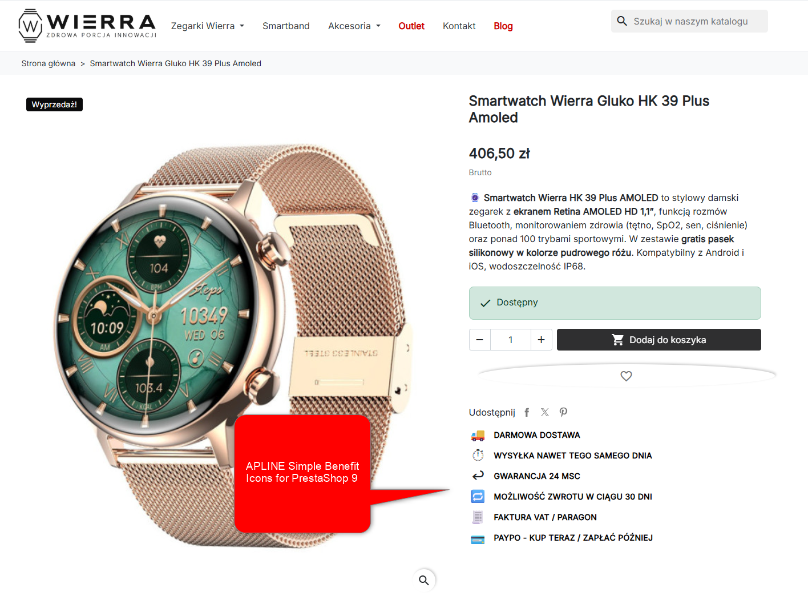

# APLINE Simple Benefit Icons for PrestaShop 9

A lightweight, distributable PrestaShop **9.0.x** module that displays a
configurable block of **benefit rows** (image **or** HTML‑entity icon + text,
with an optional clickable link) on the product page — similar to the native
*Customer Reassurance* block, but simpler, single‑language and dependency‑free
(classic PrestaShop API, no front build step, no Vue/webpack).

> Created by **[APLINE](https://apline.pl)** — custom PrestaShop development,
> performance optimization and integrations.

---

## ✨ Features

- ✅ Rows of **image** *or* **icon** (unicode hex / HTML entity) + **text**
- ✅ Optional **URL** — the whole row becomes a link, with a per‑row
  *open in new tab* switch (`target="_blank" rel="noopener noreferrer"`)
- ✅ **Drag & drop** ordering, enable/disable per row
- ✅ Configurable display location: product reassurance area, left/right
  column, product footer — or anywhere via `{widget name='apline_simple_benefit_icons'}`
- ✅ Strict, English‑only validation:
  - required fields, 255‑char limit (rejected, never silently truncated)
  - URL format check
  - image upload hardened: **JPG / PNG / WEBP only**, real MIME inspection
    (not just the extension), **2 MB** size cap → blocks disguised executables
  - `alt` required when an image is set (auto‑filled from the file name)
- ✅ **Crash‑safe**: a rendering/data error yields an empty block, never a 500;
  a failed install rolls back to a clean state
- ✅ No DRM, no telemetry
- ✅ Public GitHub, custom attribution license, modifiable
- ✅ Released for **PrestaShop 9**

## 📦 Requirements

- PrestaShop **9.0.x**
- PHP compatible with your PrestaShop 9 install
- Writable `views/img/` directory (for image uploads)

## 🚀 Installation

**Via Back Office**

1. Zip the `apline_simple_benefit_icons/` folder (the archive must contain the
   folder at its root, with forward‑slash paths). The folder name, the main
   `.php` file name and the PHP class name MUST all be `apline_simple_benefit_icons`
   — otherwise PrestaShop refuses the zip with "This file doesn't seem to be a
   valid zip module".
2. *Modules → Upload a module* → select the ZIP → install.

**Via FTP**

1. Upload the `apline_simple_benefit_icons/` folder to `modules/`.
2. *Modules* → find **APLINE Simple Benefit Icons for PrestaShop 9** → Install.

On install, a demo set of 3 icon rows is created so you can see it working
immediately.

## ⚙️ Usage

1. *Modules* → configure the module: pick the **display location** and the
   **text color**.
2. **Manage rows** → add/edit rows (image or icon + text, optional URL,
   *new tab* and *displayed* switches), reorder by drag & drop.
3. Optionally embed anywhere in your theme:

   ```smarty
   {widget name='apline_simple_benefit_icons'}
   ```

### Icon field

Instead of uploading an image you can enter an icon as:

- a bare unicode hex code, e.g. `1F69A` (🚚), or
- an HTML entity, e.g. `&#x1F69A;`

The value is validated against a whitelist and rendered as the corresponding
glyph next to the text.

## 🖼️ Screenshots

**Module configuration page** — pick the display location and the text color:



**Rows management** — drag & drop ordering, enable/disable per row:



**Front-end** — the rendered block on the product page:



## 📝 License

Custom Attribution License v1.0 — see [LICENSE.md](LICENSE.md).

You may use, modify, distribute and ship this module commercially and in
client projects. You may **not** remove or hide the APLINE attribution link
on the module configuration page. The attribution must stay visible, link to
<https://apline.pl>, and use a readable font size (≥ 12px).

## 🏢 About APLINE

Need custom PrestaShop development, performance optimization or integrations?

→ **[APLINE.PL](https://apline.pl)**
